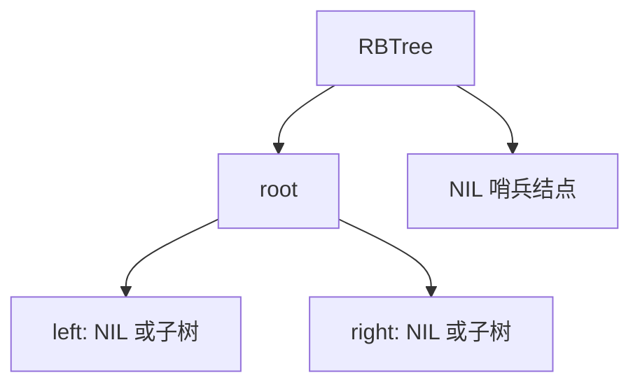

- [一、红黑树](#一红黑树)
- [二、红黑树与AVL树](#二红黑树与avl树)
- [三、红黑树的插入](#三红黑树的插入)
  - [3.1 错误的方式](#31-错误的方式)
  - [3.2 正确旋转的两种方式](#32-正确旋转的两种方式)
  - [3.3 左旋代码实现](#33-左旋代码实现)
  - [3.4 右旋代码实现](#34-右旋代码实现)
- [四、RBtree插入完整代码+测试代码+运行结果](#四rbtree插入完整代码测试代码运行结果)
  - [4.1 插入代码](#41-插入代码)
  - [4.2 测试代码](#42-测试代码)
  - [4.3 运行结果](#43-运行结果)
- [五、删除算法](#五删除算法)

红黑树是面试中常见的平衡搜索树主题；插入算法依赖左旋、右旋和颜色调整。

## 一、红黑树

1. 每个结点不是红的就是黑的；
2. 根结点为黑色；
3. 红结点的孩子必为黑结点；
4. (除了根结点)任一结点不管通过什么路径，到达叶子节点的黑结点数目一定相同；

总结概括：**一头一脚黑，黑同红不连：根为黑，到脚(叶子节点)的黑结点相同，红结点不相连。**

## 二、红黑树与AVL树

- AVL树 --> 由高度限定平衡，是严格意义上的平衡，绝对平衡；
- RBTree --> 由红黑颜色限定平衡，不是太严格限定树的平衡；

## 三、红黑树的插入

红黑树是二叉搜索树，按二叉搜索树的大小比较进行插入；**只能插入红色结点(黑色的话不满足黑同)，红色若相连，通过旋转解决！！！**

结构体控制头如下：

```cpp
typedef struct Node{  //红黑树结点类型
    Color color;  //红或黑色
    Type data;    //存储的数据
    struct Node *leftChild, *rightChild, *parent; //为了方便操作，左右孩子和父结点指针
}Node;

typedef struct RBTree{ //红黑树类型
    Node *root;   //根结点
    Node *NIL;    //指向一个空结点，构造了root有父结点;
}RBTree;
```

可通过树对象管理根指针，并在初始化时建立根结点与哨兵结点的约束。

模型示意如下：



在产生的结点中，每个结点的左右开始都赋值为 NIL；指向空结点，使 root 的父为空，便于操作；只能开始插入时为红结点，最终插入完成，经过旋转可为黑色。

对于要旋转的话，有如下 2 大种情形：

### 3.1 错误的方式

**直接将根结点与左右孩子交换颜色，但是就不满足根是黑色了;**

### 3.2 正确旋转的两种方式

1、

**先做一次右单旋转，在交换1结点和2结点颜色。**

右单旋后，原父结点下沉为新根的右孩子：

```text
      P                 L
     / \               / \
    L   C    =>       A   P
   / \                   / \
  A   B                 B   C
```

2、

**先做一次先左后右的双旋转，在交换1结点和4结点的颜色。**

先左旋后右旋可将折线结构调整为平衡结构：

```text
    P                 M
   /                 / \
  L        =>       L   P
   \
    M
```

**先左后右的旋转在这里可以通过：先左旋在右旋实现；实际上只写左和右旋函数就够了。**

以上的 2 个图在左边的，实际上在右边是为镜像，一个道理。

### 3.3 左旋代码实现

```cpp
void leftRotate(RBTree *t, Node *p){
    Node *s = p->rightChild;
    p->rightChild = s->leftChild;
    if(s->leftChild != t->NIL){
        s->leftChild->parent = p;
    }
    s->parent = p->parent;
    if(p->parent == t->NIL){
        t->root = s;
    }else if(p == p->parent->leftChild){
        p->parent->leftChild = s;
    }else{ 
        p->parent->rightChild = s;
    }

    s->leftChild = p;
    p->parent = s;
}
```

### 3.4 右旋代码实现

```cpp
void rightRotate(RBTree *t, Node *p){
    Node *s = p->leftChild;
    p->leftChild = s->rightChild;
    if(s->rightChild != t->NIL){
        s->rightChild->parent = p;
    }
    s->parent = p->parent;

    if(p->parent == t->NIL){
        t->root = s;
    }else if(p == p->parent->leftChild){
        p->parent->leftChild = s;
    }else{
        p->parent->rightChild = s;
    }

    s->rightChild = p;
    p->parent = s;
}
```

## 四、RBtree插入完整代码+测试代码+运行结果

> **文本化验证：** 运行测试后应覆盖正常输入、边界输入和错误路径；核对输出顺序、返回值与关键数据结构状态是否符合预期。

### 4.1 插入代码

```cpp
#ifndef _RBTREE_H_
#define _RBTREE_H_

#include<malloc.h>

typedef enum{RED, BLACK} Color;

typedef struct Node{
    Color color;
    Type data;
    struct Node *leftChild, *rightChild, *parent;
}Node;

typedef struct RBTree{
    Node *root;
    Node *NIL;
}RBTree;

Node *createNode();   //创建一个结点空间
void initRBTree(RBTree **t);  //初始化红黑树
void leftRotate(RBTree *t, Node *p);  //坐旋转函数
void rightRotate(RBTree *t, Node *p);  //右旋转函数
void insertFixup(RBTree *t, Node *x);   //插入的调整函数
bool insert(RBTree *t, Type x);    //插入函数
void showRBTree(RBTree rb);       //显示函数
void show(RBTree rb, Node *t);   //真正的显示函数

void show(RBTree rb, Node *t){
    if(t != rb.NIL){
        show(rb, t->leftChild);
        printf("%d : %d\n", t->data, t->color);
        show(rb, t->rightChild);
    }
}

void showRBTree(RBTree rb){
    show(rb, rb.root);
}

bool insert(RBTree *t, Type x){
    Node *s = t->root;
    Node *p = t->NIL;
    while(s != t->NIL){  //找插入位置
        p = s;
        if(p->data == x){
            return false;
        }else if(x < p->data){
            s = s->leftChild;
        }else{
            s = s->rightChild;
        }
    }

    Node *q = createNode();
    q->data = x;
    q->parent = p;

    if(p == t->NIL){
        t->root = q;
    }else if(x < p->data){
        p->leftChild = q;
    }else{
        p->rightChild = q;
    }

    q->leftChild = t->NIL; //都指向空结点
    q->rightChild = t->NIL;

    q->color = RED;  //插入结点颜色为红

    insertFixup(t, q);  //调用一个调整函数

    return true;
}

void insertFixup(RBTree *t, Node *x){
    Node *s;
    while(x->parent->color == RED){
        if(x->parent == x->parent->parent->leftChild){  //leftChild
            s = x->parent->parent->rightChild;
            if(s->color == RED){
                x->parent->color = BLACK;
                s->color = BLACK;
                x->parent->parent->color = RED;
                x = x->parent->parent;
                continue;
            }else if(x == x->parent->rightChild){
                x = x->parent;
                leftRotate(t, x);
            }

            x->parent->color = BLACK; //交换颜色
            x->parent->parent->color = RED;
            rightRotate(t, x->parent->parent);
            
        }else{  //rightChild
          s = x->parent->parent->leftChild;
            if(s->color == RED){
                x->parent->color = BLACK;
                s->color = BLACK;
                x->parent->parent->color = RED;
                x = x->parent->parent;
                continue;
            }else if(x == x->parent->leftChild){
                x = x->parent;
                rightRotate(t, x);
            }

            x->parent->color = BLACK;  //交换颜色
            x->parent->parent->color = RED;
            leftRotate(t, x->parent->parent);
        }
    }
    t->root->color = BLACK;
}


void rightRotate(RBTree *t, Node *p){
    Node *s = p->leftChild;
    p->leftChild = s->rightChild;
    if(s->rightChild != t->NIL){
        s->rightChild->parent = p;
    }
    s->parent = p->parent;

    if(p->parent == t->NIL){
        t->root = s;
    }else if(p == p->parent->leftChild){
        p->parent->leftChild = s;
    }else{
        p->parent->rightChild = s;
    }

    s->rightChild = p;
    p->parent = s;
}
void leftRotate(RBTree *t, Node *p){
    Node *s = p->rightChild;
    p->rightChild = s->leftChild;
    if(s->leftChild != t->NIL){
        s->leftChild->parent = p;
    }
    s->parent = p->parent;
    if(p->parent == t->NIL){
        t->root = s;
    }else if(p == p->parent->leftChild){
        p->parent->leftChild = s;
    }else{ 
        p->parent->rightChild = s;
    }

    s->leftChild = p;
    p->parent = s;
}
    
void initRBTree(RBTree **t){
    (*t) = (RBTree *)malloc(sizeof(RBTree));
    (*t)->NIL = createNode();
    (*t)->root = (*t)->NIL;
    (*t)->NIL->color = BLACK;
    (*t)->NIL->data = -1;
}
Node *createNode(){
    Node *p = (Node *)malloc(sizeof(Node));
    p->color = BLACK;
    p->data = 0;
    p->leftChild = p->rightChild = p->parent = NULL;

    return p;
}

#endif
```

### 4.2 测试代码

```cpp
#include<stdio.h>

typedef int Type;

#include"RBTree.h"

int main(void){
    RBTree *rb;
    int ar[] = {10, 7, 4, 8, 15, 5, 6, 11, 13, 12,};
    //int ar[] = {10, 7, 5};
    int n = sizeof(ar)/sizeof(int);
    int i;

    initRBTree(&rb);
    for(i = 0; i < n; i++){
        insert(rb, ar[i]);
    }
    
    printf("0代表红，1代表黑\n");
    showRBTree(*rb);
    return 0;
}
```

### 4.3 运行结果

> **文本化验证：** 运行测试后应覆盖正常输入、边界输入和错误路径；核对输出顺序、返回值与关键数据结构状态是否符合预期。

## 五、删除算法

红黑树的删除思路：**在搜索二叉树中，永远记住删除结点，先化为只有左树或右树一个分支在解决；**

**所以，先找到结点，在转换为只有一个分支的，在删除(只能删除红色的结点)，可能通过旋转调整函数进行平衡！！！**


## 补充：红黑树性质与删除修复

```text
1. 根为黑；2. NIL 叶子为黑；3. 红结点孩子为黑；
4. 从任一结点到后代 NIL 的每条路径黑高相同。
```

- 插入时新结点通常为红，通过变色和至多两次旋转恢复性质；根最终必须置黑。
- 删除黑结点可能产生“额外黑色”问题，需要按兄弟结点颜色和侄子颜色分情况修复。
- 红黑树保证高度 O(log n)，旋转次数通常少于 AVL，因此常用于写多读多的通用有序容器。
- 哨兵 NIL 结点能减少空指针分支，但必须保证其颜色、父指针和生命周期约定一致。

## 面试辅导

### 面试考点全景图

| 维度 | 回答要点 | 面试高频追问 |
| --- | --- | --- |
| 核心定义 | `红黑树` 属于数据结构与算法，关注数据表示、不变量和操作复杂度之间的取舍。 | 它解决什么问题，前置条件是什么？ |
| 关键角色 | 结点/数组、索引/指针、根/头尾指针、不变量。 | 每个角色的状态、生命周期和责任边界是什么？ |
| 优点 | 通过明确数据、资源或执行边界提高可推理性。 | 复杂度、性能或维护收益如何验证？ |
| 代价 | 会带来状态维护、边界检查或实现复杂度。 | 在什么场景下不适合使用？ |
| 应用场景 | 需要逻辑结构、物理存储、核心操作、复杂度和边界状态的程序或系统任务。 | 如何从现有实现平滑迁移？ |

### 面试官追问链

1. **基础：** 请定义 `红黑树`，说明它的输入、输出和核心约束。
2. **机制：** 逻辑结构、物理存储、核心操作、复杂度和边界状态；关键状态如何变化？
3. **深入：** 与相邻数据结构或实现方式相比，内存布局、时间复杂度、空间复杂度、迭代稳定性和适用负载有什么不同？
4. **工程：** 失败、边界输入、资源耗尽或并发访问时如何保持正确性？
5. **优化：** 用哪些时间、空间、吞吐或可观测性指标验证优化有效？

### 横向对比

| 对比项 | `红黑树` | 相邻数据结构或实现方式 | 选择建议 |
| --- | --- | --- | --- |
| 核心目标 | 数据表示、不变量和操作复杂度之间的取舍 | 解决相邻但边界不同的问题 | 按问题约束选择，而不是只按熟悉程度选择。 |
| 主要成本 | 状态维护、边界处理与测试成本 | 成本模型不同，可能偏向性能或抽象能力 | 用实际数据规模和故障模型评估。 |
| 适用条件 | 需要逻辑结构、物理存储、核心操作、复杂度和边界状态 | 需要不同的资源、数据或执行模型 | 优先保证正确性、可观测性和可维护性。 |

### 缺失知识点与工程注意事项

- 面试中要同时说明空结构、单元素、扩容/缩容、删除和重复键等边界条件。
- 回答时应区分标准/系统保证与具体实现细节；未定义行为和未检查错误码不能作为可靠前提。
- 测试至少覆盖正常路径、边界路径和失败路径，并验证资源是否按预期释放或回收。

### 代码注释提示

```c
// 面试考点：说明此处的数据不变量或接口契约。
// 边界条件：明确空输入、容量上限、错误返回和资源释放责任。
// 复杂度：标注关键操作的时间/空间复杂度及其前提。
// 工程约束：共享状态、系统调用或指针访问需要说明同步/错误处理策略。
```

### 可能的面试题

- **问题：** “请说明 `红黑树` 的核心不变量，并描述一个最容易出错的边界场景。”
- **简要答案：** 先写出不变量，再用插入、删除和查询操作证明不变量在每一步都被维护。
