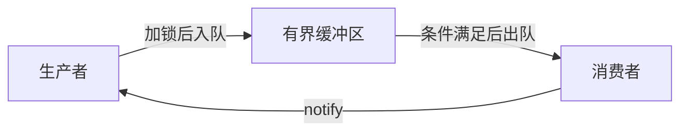

- [一、生产者与消费者问题](#一生产者与消费者问题)
- [二、代码实现](#二代码实现)

## 一、生产者与消费者问题

- 空间满：生产者不能生产数据；
- 空间空：消费者不能取出数据；

在这种模型下，将会有(生产者：消费者)为：一对一、一对多、多对一、多对多。

为了简化问题，在这里就只实现一个生产者和一个消费者的问题。

模型如下：



注意：

1. **线程阻塞时，用条件变量来解决。唤醒并运行其后的语句是在遇到阻塞之后；**
2. **临界区模式；**

```cpp
pthread_mutex_lock(&mutex);
//临界区
pthread_cond_wait(&cond, &mutex); //该函数将自动解锁，此处将会发生阻塞。

......

pthread_mutex_unlock(&mutex);
```

3. **本题还可以采用双缓冲区；**

## 二、代码实现

```cpp
#include<stdio.h>
#include<unistd.h>
#include<stdlib.h>
#include<string.h>
#include<pthread.h>

#define BUF_SIZE    8   //一个开辟8个数组元素空间
#define MAX_NUM     20   //将一共产生20个数据

struct PC{   //生产者与消费者结构体
    pthread_mutex_t mutex;  //互斥量
    pthread_cond_t noempty;  //条件变量，数组不空
    pthread_cond_t nofull;   //条件变量，数组不满
    int buf[BUF_SIZE];  //开辟空间
    int nput;  //数组下标
    int nval;  //要存放的数据
    int size;  //统计当前数组空间大小
}shared = {PTHREAD_MUTEX_INITIALIZER, PTHREAD_COND_INITIALIZER, PTHREAD_COND_INITIALIZER};

void* producer(void *arg){
    for(;;){
        pthread_mutex_lock(&shared.mutex);
        if(shared.nval > MAX_NUM){
            pthread_mutex_unlock(&shared.mutex);
            break;
        }
        shared.buf[shared.nput] = shared.nval;
        shared.nput++;
        shared.nval++;
        shared.size++;

        if(shared.nput >= BUF_SIZE){
            shared.nput = 0;  //下标始终在0-7
        }
        if(shared.size >= BUF_SIZE){ 
            pthread_cond_wait(&shared.nofull, &shared.mutex);
        }else{
            pthread_cond_signal(&shared.noempty);
        }
        pthread_mutex_unlock(&shared.mutex);
    }
}

void *customer(void *arg){
    int value;
    int i = 0;
    for(;;){
        pthread_mutex_lock(&shared.mutex);
        value = shared.buf[i];
        i++;
        printf("value = %d\n", value);   
        if(value >= MAX_NUM){
            pthread_mutex_unlock(&shared.mutex);
            break;
        }
        sleep(1);

        if(i >= BUF_SIZE){
            i = 0;
        }
        shared.size--;
        if(shared.size == 0){
            pthread_cond_wait(&shared.noempty, &shared.mutex);
        }else{
            pthread_cond_signal(&shared.nofull);
        }

        pthread_mutex_unlock(&shared.mutex);
    }
}

void initPc(void){  //对结构体成员初始化
    memset(shared.buf, 0, BUF_SIZE);   
    shared.nput = 0;  //下标从0开始
    shared.nval = 1;  //存放的数据从1开始
    shared.size = 0;  //数组空间大小为0
}

int main(void){
    initPc();
    pthread_t pid, cid;
    pthread_create(&pid, NULL, producer, NULL);
    pthread_create(&cid, NULL, customer, NULL);

    pthread_join(pid, NULL);
    pthread_join(cid, NULL);

    return 0;
}
```

> **文本化验证：** 执行示例后应核对返回值、输出顺序和资源状态；同时覆盖空输入、边界输入与失败路径。

</br>

对以上的代码模式解读：首先是生产者生产，在空间满了之后，阻塞等待，此时，消费者在读取数据，等到读取为空的时候，唤醒生产者生产，最后，在生产完了的时候，消费者读取完成，将一起退出for循环。

**这里的同步就是利用了锁机制完成的(通过互斥量和条件变量)。**


## 补充：有界缓冲区不变量

```text
0 <= queue_size <= capacity
生产者：queue_size == capacity 时等待 not_full
消费者：queue_size == 0        时等待 not_empty
```

- 条件变量必须与互斥量配合，并用 `while` 或带谓词的 `wait` 处理伪唤醒。
- 修改队列状态和判断条件必须在同一把锁保护下；通知可在解锁后进行，但必须先完成状态更新。
- 关闭队列时应设置 `closed` 标志并 `notify_all`，使等待线程能够退出，避免线程池停机死锁。

**验证要点：** 用多个生产者、多个消费者、容量为 1 的队列和提前关闭场景测试不丢数据、不重复消费且可退出。

## 面试辅导

### 面试考点全景图

| 维度 | 回答要点 | 面试高频追问 |
| --- | --- | --- |
| 核心定义 | `生产者与消费者` 属于网络编程，重点是Linux 并发、IPC、I/O 或网络服务中的协作机制。 | 它解决了什么问题，边界在哪里？ |
| 关键角色 | 客户端、服务端、内核对象、缓冲区、同步原语。 | 各角色的职责、依赖方向和生命周期是什么？ |
| 优点 | 通过清晰边界降低耦合，并让复杂度、资源或并发控制可被推理。 | 性能收益是否可量化？ |
| 代价 | 会引入额外抽象、状态管理或运行时/维护成本。 | 何时不应使用？ |
| 适用场景 | 需求满足本节的约束，并且需要明确演进、资源或并发边界时。 | 如何在现有工程中渐进式落地？ |

### 面试官追问链

1. **基础：** 请定义 `生产者与消费者`，并用本节示例说明它解决的实际问题。
2. **机制：** 说明数据流、阻塞点、并发控制和故障恢复；关键对象、调用顺序或数据流是什么？
3. **深入：** 与相近 IPC、I/O 或并发模型相比，通信边界、拷贝次数、阻塞语义、扩展性和故障隔离有什么取舍？
4. **工程：** 出现异常、资源不足、并发竞争或输入非法时如何保证正确性？
5. **优化：** 在基准数据明确后，如何定位瓶颈并以复杂度、延迟或内存指标验证优化？

### 横向对比

| 对比项 | `生产者与消费者` | 相近 IPC、I/O 或并发模型 | 选择建议 |
| --- | --- | --- | --- |
| 核心目标 | Linux 并发、IPC、I/O 或网络服务中的协作机制 | 解决相邻但边界不同的问题 | 先按问题边界选择，不按名词选择。 |
| 主要成本 | 抽象、状态与维护成本 | 成本模型不同，可能偏向性能或灵活性 | 用实际负载和团队维护能力评估。 |
| 适用条件 | 需要说明数据流、阻塞点、并发控制和故障恢复 | 需要不同的数据流、生命周期或调用方式 | 不能同时满足时，优先保证正确性与可观测性。 |

### 容易忽略的知识点

- 警惕部分读写、EINTR、惊群、伪唤醒、死锁、fd 泄漏和关闭时序。
- 面试回答要区分**语言/库的保证**与**当前实现的经验行为**，避免把未定义行为或实现细节当作标准。
- 先说明前置条件和失败路径；“能跑”不是工程正确性，资源回收、日志和测试同样是答案的一部分。

### 代码注释提示

```cpp
// 面试考点：这里说明 `生产者与消费者` 的职责边界，而不是重复代码字面含义。
// 所有权/并发：明确谁创建、谁释放资源；共享状态必须说明同步策略。
// 复杂度：标注关键路径的时间和空间复杂度，说明优化前提。
// 扩展性：通过稳定接口隔离变化，避免让调用方依赖具体实现。
```

### 可能的面试题

- **可能的面试题：** “请结合 `生产者与消费者` 说明设计/实现选择，并给出一个失败场景。”
- **简要答案：** 先画清调用与数据流，再分析阻塞、竞态、超时、背压和资源回收。
