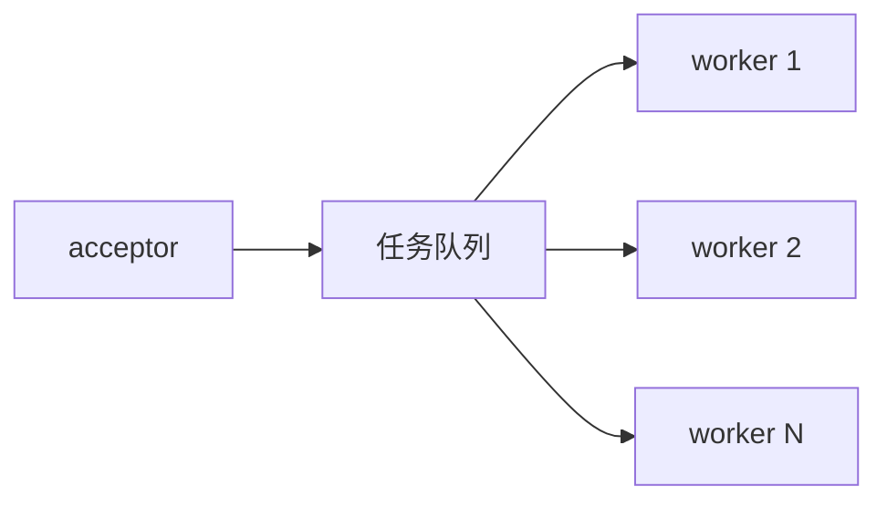

- [一、线程池网络服务](#一线程池网络服务)
- [二、代码实现](#二代码实现)
  - [2.1、utili.h](#21utilih)
  - [2.2、ser.c](#22serc)
  - [2.3、cli.c](#23clic)
  - [2.4、运行结果](#24运行结果)
- [三、分析总结](#三分析总结)

## 一、线程池网络服务

针对多线程网络服务模式的一些不足之处而提出的改进模式。

池是一个很重要的概念，其基本理念是：**先创建一批资源，当有用户到来时，直接分配以创建好的资源，它的主要目的是减少系统在频繁创建资源时的开销。**

实现原理：主服务线程创建既定数量的服务线程，当有客户端到来时，则从线程池中找出空闲的服务线程，为其服务，服务完毕后，线程不进行释放，重新放回线程池；若当前线程池已满，则将当前的客户端加入等待队列。

模型如下：



## 二、代码实现

同样用处理整数运算来模拟线程池的并发处理。

### 2.1、utili.h

```cpp
#include<unistd.h>
#include<stdio.h>
#include<string.h>
#include<stdlib.h>
#include<sys/socket.h>
#include<netinet/in.h>
#include<arpa/inet.h>
#include<pthread.h>

#define SERVER_PORT  8090
#define SERVER_IP    "127.0.0.1"
#define LISTEN_QUEUE  5
#define BUFFER_SIZE   255
#define CMD_SIZE      20    

#define THREAD_POOL_NUM  5

typedef enum{ADD,SUB,MUL,DIV,MOD, QUIT}OPER_TYPE;
typedef enum{IDEL, BUSY}THREAD_TAG;

typedef struct OperStruct{
    int op1;
    int op2;
    OPER_TYPE oper;
}OperStruct;
```

### 2.2、ser.c

```cpp
#include"../utili.h"

typedef struct PoolStruct{
    int sockConn;
    THREAD_TAG flag; 
}PoolStruct;

typedef PoolStruct threadpool[THREAD_POOL_NUM];
threadpool pool;
pthread_t  tid[THREAD_POOL_NUM];

void* Thread_Handler(void *arg);

void* Thread_Handler(void *arg){
    int index = *(int *)arg;

    printf("[%d] thread start up.\n", index);

    OperStruct op; 
    int result;
    while(1){
        if(pool[index].flag == BUSY){
            printf("[%d] thread start wroking.\n", index);
            int res = recv(pool[index].sockConn, &op, sizeof(op), 0); 
            if(res == -1){
                printf("recv data fail.\n");
                continue;
            }
            if(op.oper == ADD){
                result = op.op1 + op.op2;
            }else if(op.oper == SUB){
                result = op.op1 - op.op2;
            }else if(op.oper == MUL){
                result = op.op1 * op.op2;
            }else if(op.oper == DIV){
                result = op.op1 / op.op2;
            }else if(op.oper == QUIT){
                break;
            }
            res = send(pool[index].sockConn, &result, sizeof(result), 0);
            if(res == -1){
                printf("send data fail.\n");
                continue;
            }
        }else{
            printf("[%d] thread sleep.\n",index);
            sleep(1);
        }
    }
    close(pool[index].sockConn);
    pthread_exit(0);
}    
int main(void){
    int sockSer = socket(AF_INET, SOCK_STREAM, 0);
    if(sockSer == -1){
        perror("socket");
        return -1;
    }
    struct sockaddr_in addrSer, addrCli;
    addrSer.sin_family = AF_INET;
    addrSer.sin_port = htons(SERVER_PORT);
    addrSer.sin_addr.s_addr = inet_addr(SERVER_IP);

    socklen_t len = sizeof(struct sockaddr);
    int res = bind(sockSer, (struct sockaddr*)&addrSer, len);
    if(res == -1){
        perror("bind");
        close(sockSer);
        return -1;
    }

    listen(sockSer, LISTEN_QUEUE);

    int i;
    for(i=0; i<THREAD_POOL_NUM; ++i){
        pthread_create(&tid[i], NULL, Thread_Handler, &i);
        sleep(1);
    }
    for(i=0; i<THREAD_POOL_NUM; ++i){    
        pool[i].sockConn = 0;
        pool[i].flag = IDEL;
    }

    int sockConn;
    while(1){
        printf("Server Wait Client Connect.......\n");
        sockConn = accept(sockSer, (struct sockaddr*)&addrCli, &len);
        if(sockConn == -1){
            printf("Server Accept Client Connect Fail.\n");
            continue;
        }else{
            printf("Server Accept Client Connect Success.\n");
            printf("Client IP:>%s\n", inet_ntoa(addrCli.sin_addr));
            printf("Client Port:>%d\n",ntohs(addrCli.sin_port));
        }
        for(i=0; i<THREAD_POOL_NUM; ++i){
            if(pool[i].flag == IDEL){
                pool[i].flag = BUSY;
                pool[i].sockConn = sockConn;
                break;
            }
        }
    }
    close(sockSer);
    return 0;
}
```

### 2.3、cli.c

```cpp
#include"utili.h"

void InputData(OperStruct *pt);

void InputData(OperStruct *pt){
    printf("please input op1 and op2 : ");
    scanf("%d %d", &(pt->op1), &(pt->op2));
}

//Cli
int main(void){
    int sockCli = socket(AF_INET, SOCK_STREAM, 0); 
    if(sockCli == -1){
        perror("socket");
        return -1; 
    }   
    struct sockaddr_in addrSer;
    addrSer.sin_family = AF_INET;
    addrSer.sin_port = htons(SERVER_PORT);
    addrSer.sin_addr.s_addr = inet_addr(SERVER_IP);

    socklen_t len = sizeof(struct sockaddr);
    int res = connect(sockCli, (struct sockaddr*)&addrSer, len);
    if(res == -1){
        perror("connect");
        close(sockCli);
        return -1; 
    }else{
        printf("Client Connect Server Success.\n");
    }

    char cmd[2];
    OperStruct  op;
    int result;
    while(1){
        printf("Please input operator : ");
        scanf("%s",cmd);
        if(strcmp(cmd, "+") == 0){
            op.oper = ADD;
            InputData(&op);
        }else if(strcmp(cmd,"-") == 0){
            op.oper = SUB;
            InputData(&op);
        }else if(strcmp(cmd,"*") == 0){
            op.oper = MUL;
            InputData(&op);
        }else if(strcmp(cmd,"/") == 0){
            op.oper = DIV;
            InputData(&op);
        }else if(strcmp(cmd, "quit") == 0){
            op.oper = QUIT;
        }else{
            printf("Cmd invalid.\n");   
       }

        res = send(sockCli, &op, sizeof(op), 0);
        if(res == -1){
            printf("send data fail.\n");
            continue;
        }
        if(op.oper == QUIT)
            break;
        res = recv(sockCli, &result, sizeof(result), 0);
        if(res == -1){
            printf("recv data fail.\n");
            continue;
        }
        printf("result = %d\n", result);
    }
    close(sockCli);
    return 0;
}
```

### 2.4、运行结果

> **文本化验证：** 运行测试后应覆盖正常输入、边界输入和错误路径；核对输出顺序、返回值与关键数据结构状态是否符合预期。

服务器端：

客户端1

客户端2

## 三、分析总结

1. 其优点：性能高效
2. 可能存在的问题：新用户如果在等待队列里耗时过长，会影响用户体验，针对此问题，改进方案如下：
   - **动态创建新的服务线程，服务结束后，该线程加入线程池，这种改进的好处是，用户体验得到提升，潜在问题是，在长时间，大规模的并发用户状态下，线程会产生很多，最终会因为资源消耗过多，系统退出。**
   - **增加一个线程资源回收机制，当线程池的规模达到一定程度或满足某种既定规则时，会主动杀死一些线程，以达到系统稳定和用户体验之间折中。**

模型分析

**当有客户端来，有2种做法：**

1. **创建线程为其服务；**
2. **加入等待队列；这2种都不太合适，采用折中法，有一个上限值，即就是规定一个创建线程的最大数，当来一个用户，还没达到线程最大数时，为其创建线程，若达到了，则加入等待队列；**

**对线程资源的回收：**

1. **立马回收；**
2. **暂时不回收；当空闲的线程数达到某一下限值时，此时再将线程回收；**


## 补充：线程池生命周期

```text
Created -> Running -> Draining -> Stopped
             |            |
          submit()      reject/new task policy
             v
          task queue -> worker executes -> result/cleanup
```

- 任务队列必须有容量或背压策略；无限队列会把过载从 CPU 转移为内存耗尽和高延迟。
- 停止线程池时先拒绝新任务，再选择“排空队列”或“取消未执行任务”，最后唤醒并 `join` 所有工作线程。
- 网络连接的所有权要明确：任务执行完由谁关闭 fd、异常时如何回收、超时后如何取消。

**验证要点：** 压测高并发提交、队列满、任务抛异常和停机竞态，检查任务计数、fd 数量和线程是否全部回收。

## 面试辅导

### 面试考点全景图

| 维度 | 回答要点 | 面试高频追问 |
| --- | --- | --- |
| 核心定义 | `线程池服务` 属于网络编程，重点是Linux 并发、IPC、I/O 或网络服务中的协作机制。 | 它解决了什么问题，边界在哪里？ |
| 关键角色 | 客户端、服务端、内核对象、缓冲区、同步原语。 | 各角色的职责、依赖方向和生命周期是什么？ |
| 优点 | 通过清晰边界降低耦合，并让复杂度、资源或并发控制可被推理。 | 性能收益是否可量化？ |
| 代价 | 会引入额外抽象、状态管理或运行时/维护成本。 | 何时不应使用？ |
| 适用场景 | 需求满足本节的约束，并且需要明确演进、资源或并发边界时。 | 如何在现有工程中渐进式落地？ |

### 面试官追问链

1. **基础：** 请定义 `线程池服务`，并用本节示例说明它解决的实际问题。
2. **机制：** 说明数据流、阻塞点、并发控制和故障恢复；关键对象、调用顺序或数据流是什么？
3. **深入：** 与相近 IPC、I/O 或并发模型相比，通信边界、拷贝次数、阻塞语义、扩展性和故障隔离有什么取舍？
4. **工程：** 出现异常、资源不足、并发竞争或输入非法时如何保证正确性？
5. **优化：** 在基准数据明确后，如何定位瓶颈并以复杂度、延迟或内存指标验证优化？

### 横向对比

| 对比项 | `线程池服务` | 相近 IPC、I/O 或并发模型 | 选择建议 |
| --- | --- | --- | --- |
| 核心目标 | Linux 并发、IPC、I/O 或网络服务中的协作机制 | 解决相邻但边界不同的问题 | 先按问题边界选择，不按名词选择。 |
| 主要成本 | 抽象、状态与维护成本 | 成本模型不同，可能偏向性能或灵活性 | 用实际负载和团队维护能力评估。 |
| 适用条件 | 需要说明数据流、阻塞点、并发控制和故障恢复 | 需要不同的数据流、生命周期或调用方式 | 不能同时满足时，优先保证正确性与可观测性。 |

### 容易忽略的知识点

- 警惕部分读写、EINTR、惊群、伪唤醒、死锁、fd 泄漏和关闭时序。
- 面试回答要区分**语言/库的保证**与**当前实现的经验行为**，避免把未定义行为或实现细节当作标准。
- 先说明前置条件和失败路径；“能跑”不是工程正确性，资源回收、日志和测试同样是答案的一部分。

### 代码注释提示

```cpp
// 面试考点：这里说明 `线程池服务` 的职责边界，而不是重复代码字面含义。
// 所有权/并发：明确谁创建、谁释放资源；共享状态必须说明同步策略。
// 复杂度：标注关键路径的时间和空间复杂度，说明优化前提。
// 扩展性：通过稳定接口隔离变化，避免让调用方依赖具体实现。
```

### 可能的面试题

- **可能的面试题：** “请结合 `线程池服务` 说明设计/实现选择，并给出一个失败场景。”
- **简要答案：** 先画清调用与数据流，再分析阻塞、竞态、超时、背压和资源回收。
